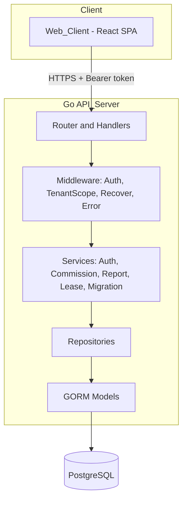
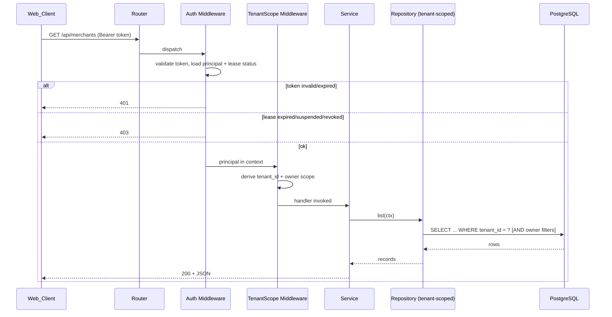
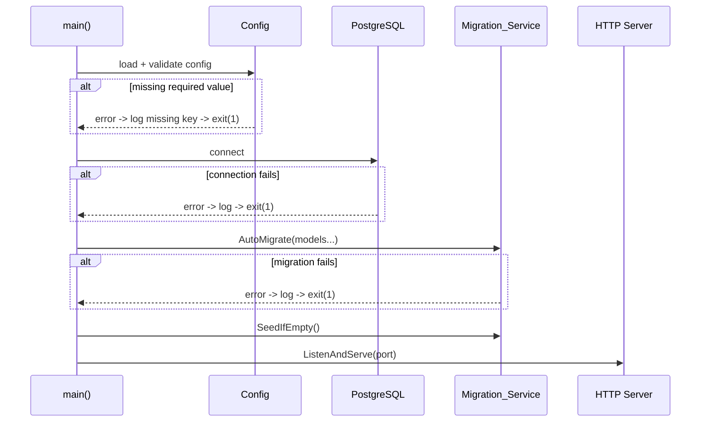
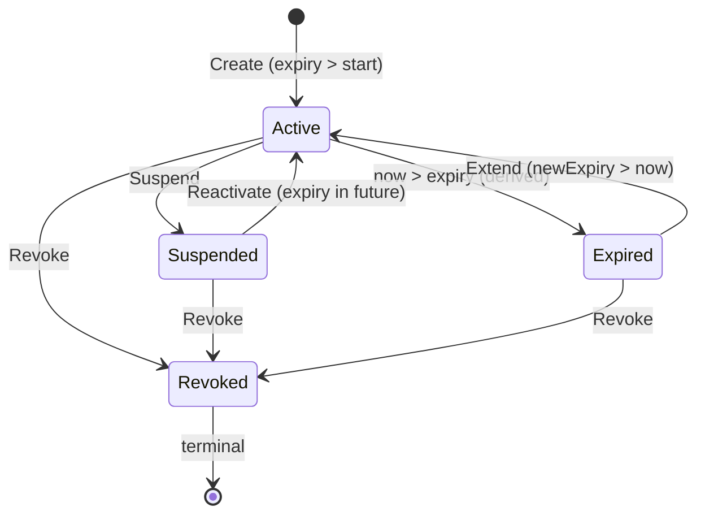
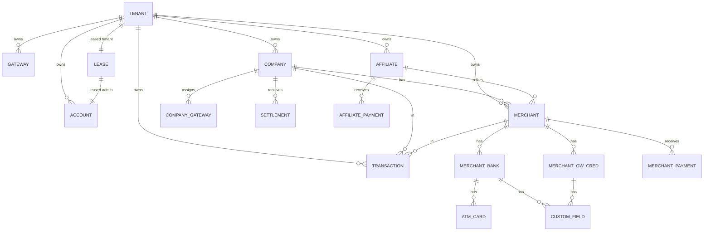

# Design Document

## Overview

This design introduces a Go REST API backend (the `API_Server`) backed by PostgreSQL via GORM, replacing the React SPA's localStorage persistence. The backend owns all data storage, the commission calculation engine, ledger/report aggregation, authentication, role-based authorization, and a new multi-tenant leasing capability. The React `Web_Client` is migrated to consume the API while preserving every existing screen and behavior.

The system serves two layered goals:

1. **Lift-and-shift of existing logic to the server.** The current frontend modules `calc.js` (commission engine + ledgers), `seed.js` (demo data + entity shapes), `store.jsx` (auth + CRUD), and `export.js` (CSV/PDF export) become authoritative server-side components. The `Commission_Engine` must produce results equivalent to `calc.js` for the same inputs (Req 9.7).
2. **Multi-tenant leasing.** A new `SuperAdmin` role runs its own business exactly like an `Admin`, and can additionally lease isolated platform instances to new `Admin` accounts. Each lease creates a new `Admin` account, a dedicated `Tenant`, and a `Lease` record with a defined tenure and status (Active/Expired/Suspended/Revoked).

A central design principle is **tenant isolation by construction**: every business entity carries a `tenant_id`, and a GORM scope applied through authorization middleware constrains every read and write to the authenticated principal's tenant. Cross-tenant access returns HTTP 404 and never discloses the record (Req 4.3, 18.2).

This is a client demo on the path to production, so two existing demo behaviors are explicitly corrected: plaintext credentials become bcrypt hashes (Req 5.5, 6.4), and unauthenticated data access becomes token-authenticated, role-scoped access (Req 7.6).

### Requirements addressed

This design addresses Requirements 1–18. Key cross-cutting decisions:

- **Persistence**: PostgreSQL + GORM with auto-migration on startup (Req 1, 5).
- **Auth**: bcrypt password hashing + JWT-based `Session_Token` carrying principal/role/tenant, with server-side revocation for logout (Req 6, 7).
- **Isolation**: `tenant_id` on every business entity + GORM scope injected via middleware (Req 3, 4).
- **Computation parity**: `Commission_Engine` ported field-for-field from `calc.js` (Req 9, 10).
- **Leasing**: `Lease_Manager` with a derived status state machine (Req 13–15).

## Architecture

### High-level component view



### Layered responsibilities

The `API_Server` is organized into clear layers so transport, business logic, and persistence remain independent.

- **Router / Handlers** (`internal/api`): HTTP routing, request decoding, response encoding, status-code selection. Handlers are thin; they delegate to services. Unsupported route/method returns 404/405 with a structured body (Req 1.7).
- **Middleware** (`internal/middleware`): cross-cutting concerns applied per request:
  - *Recover*: traps panics, returns 500 without leaking stack traces (Req 18.4).
  - *Auth*: validates the `Session_Token`, loads the principal (role, tenant, lease status), rejects missing/invalid/expired tokens with 401 and expired/suspended/revoked leases with 403 (Req 6.5, 6.6, 7.2, 14.3, 15.4, 15.6).
  - *TenantScope*: derives the active `tenant_id` and the owner-scope (for Company/Affiliate/Merchant) and places them in the request context for repositories to consume (Req 4, 7.5).
  - *Error*: converts service errors into the consistent API error model (Req 18).
- **Services** (`internal/service`): business logic. `Auth_Service`, `Commission_Engine`, `Report_Service`, `Lease_Manager`, `Migration_Service`, plus per-entity CRUD services.
- **Repositories** (`internal/repo`): GORM data access. Every business-entity query is built from a tenant-scoped `*gorm.DB` so isolation cannot be bypassed by forgetting a filter.
- **Models** (`internal/model`): GORM struct definitions and relationships.
- **Config** (`internal/config`): environment/config loading and validation (Req 2).

### Request lifecycle



### Startup sequence



Migrations and seeding complete before the server accepts requests (Req 1.4, 1.5, 1.6).

### The React client migration

The client keeps all screens, routes, and components. Only the data layer changes:

- `store.jsx` is rewritten to call the API through a new `apiClient` instead of mutating a localStorage object. The `StoreProvider` keeps the same `useStore()` contract (`db`, `auth`, `add`, `update`, `remove`, `login`, `logout`) so pages need minimal changes; collection getters become API-backed reads/caches.
- `calc.js` ledger/commission functions are no longer the source of truth — screens consume server-computed values (Req 17.3). `calc.js` may remain for display formatting (`inr`, `num`) only.
- `export.js` can remain for client-triggered export, but the server also offers authoritative CSV/PDF endpoints (Req 11.3, 11.4); the client uses server exports for report screens.
- A `SuperAdmin` nav entry is added below "Reports" in `Layout.jsx` (Req 16).

## Components and Interfaces

### Config (`internal/config`)

Loads settings from environment variables (with optional file fallback) and validates them before anything else runs.

| Setting | Env var | Default | Secret |
|---|---|---|---|
| DB host | `DB_HOST` | `localhost` | no |
| DB port | `DB_PORT` | `5432` | no |
| DB name | `DB_NAME` | `pgcs` | no |
| DB user | `DB_USER` | `postgres` | no |
| DB password | `DB_PASSWORD` | (none, required) | **yes** |
| HTTP port | `PORT` | `8080` | no |
| Token secret | `TOKEN_SECRET` | (none, required) | **yes** |
| Token lifetime | `TOKEN_TTL` | `24h` | no |

```go
type Config struct {
    DBHost, DBPort, DBName, DBUser, DBPassword string
    HTTPPort   string
    TokenSecret string
    TokenTTL    time.Duration
}

func Load() (*Config, error) // returns error naming the first missing required key
func (c *Config) Redacted() string // safe string for logging; secrets shown as "***"
```

Behavior:
- Missing required value → `Load` returns an error naming the missing key; `main` logs it and exits. The logging attempt is best-effort and exit happens regardless of logging success (Req 2.4).
- `Redacted()` and all log statements never print `DBPassword` or `TokenSecret` (Req 2.5).

### GORM models and relationships (`internal/model`)

See [Data Models](#data-models) for full field listings. Relationships:

- `Tenant` 1—* every business entity (via `TenantID`).
- `Account` *—1 `Tenant` (each Admin/SuperAdmin account maps to one tenant; Company/Affiliate/Merchant accounts also reference their owning entity).
- `Company` 1—* `CompanyGateway` (gateway assignments with commission % + charge bearer).
- `Merchant` 1—* `MerchantBank` 1—* `AtmCard`; `Merchant` 1—* `MerchantGatewayCredential`; `MerchantBank`/`MerchantGatewayCredential` 1—* `CustomField`.
- `Lease` 1—1 `Account` (the leased Admin) and 1—1 `Tenant`.

### Auth_Service (`internal/service/auth`)

```go
type Principal struct {
    AccountID string
    Role      string // SuperAdmin | Admin | Company | Affiliate | Merchant
    TenantID  string
    OwnerType string // "", Company, Affiliate, Merchant
    OwnerID   string // entity id for portal roles
}

type AuthService interface {
    Login(userID, password string) (token string, p Principal, err error)
    Authenticate(token string) (Principal, error) // used by middleware
    Logout(token string) error
}
```

- `Login` looks up the account by `userID`, verifies the password against the bcrypt hash (Req 6.3), and on success issues a JWT containing `account_id`, `role`, `tenant_id`, owner fields, `jti` (token id), and `exp`. Invalid credentials → 401 with a generic message that does not reveal which field was wrong (Req 6.2).
- For leased Admins, `Login` checks lease status: Expired → 403 "lease has expired" (Req 14.2); Suspended/Revoked → 403 (Req 15.4, 15.6).
- `Authenticate` validates signature + expiry, checks the token id against a server-side revocation set, re-derives lease status, and rejects appropriately.
- `Logout` adds the token's `jti` to the revocation store (a `revoked_tokens` table keyed by `jti` with the token's expiry for cleanup), invalidating the active token (Req 6.7).

**Token choice rationale.** JWT signed with HMAC-`TOKEN_SECRET` keeps validation stateless for the common path while a small `revoked_tokens` table provides explicit logout invalidation (Req 6.7) — combining stateless performance with the ability to revoke.

### TenantScope (`internal/middleware` + `internal/repo`)

`TenantScope` is enforced in the repository layer through a mandatory GORM scope so a forgotten `WHERE` cannot leak data.

```go
// Applied to every business-entity query.
func ScopeTenant(p Principal) func(*gorm.DB) *gorm.DB {
    return func(db *gorm.DB) *gorm.DB {
        db = db.Where("tenant_id = ?", p.TenantID)
        switch p.Role {
        case "Company":
            db = db.Where("company_id = ?", p.OwnerID) // where applicable
        case "Affiliate":
            db = db.Where("affiliate_id = ?", p.OwnerID)
        case "Merchant":
            db = db.Where("merchant_id = ? OR id = ?", p.OwnerID, p.OwnerID)
        }
        return db
    }
}
```

- All repository constructors require a `Principal` (or scoped `*gorm.DB`) — there is no unscoped accessor for business entities.
- On create, the repository sets `tenant_id` from the principal, ignoring any client-supplied tenant (Req 4.2).
- A fetch-by-id that matches no row within the scope returns a not-found error → handler maps to 404 (Req 4.3, 18.2). Cross-tenant reads are therefore indistinguishable from "does not exist."
- Portal roles reading outside their owner scope (but inside their tenant) get an empty set, and the attempt is logged (Req 8.6).

### Commission_Engine (`internal/service/commission`)

A pure function port of `calc.js`. No I/O, fully deterministic, which makes it ideal for property-based equivalence testing.

```go
type TxnContext struct {
    Company   *Company   // with Gateways assignments
    Merchant  *Merchant
    Affiliate *Affiliate // nil when merchant has no affiliate
}

type Breakdown struct {
    TxnAmount, SettlementAmount, TxnCharges, OtherCharges float64
    GatewayCommissionPct float64
    ChargeBearer         string // Admin | Company
    AdminCommission      float64
    Beneficiary          string // Merchant | Affiliate
    BeneficiaryPct       float64
    BeneficiaryBase      string // Transaction Amount | Settlement Amount
    BeneficiaryCommission float64
    CompanyChargesDeducted float64
    AdminChargesDeducted   float64
    AdminNetCommission     float64
    CompanyNetIncome       float64
}

func Calc(txn Transaction, ctx TxnContext) Breakdown
```

The algorithm mirrors `calc.js` exactly:

1. `gwAssign` = the company's gateway assignment matching `txn.gatewayId`; `gatewayCommissionPct` and `chargeBearer` come from it (defaults: 0% and "Admin" when no assignment) (Req 9.1).
2. `adminCommission = txnAmount * gatewayCommissionPct / 100` (Req 9.1).
3. Beneficiary selection: if merchant has an `affiliateId` and an affiliate is present → beneficiary = Affiliate, using affiliate's `commissionPct`/`commissionBase`; else beneficiary = Merchant, using merchant's values (Req 9.4, 9.5).
4. Base selection: "Transaction Amount" → `txnAmount`, else `settlementAmount` (Req 9.6). `beneficiaryCommission = base * beneficiaryPct / 100`.
5. `companyNetIncome = settlementAmount - adminCommission`; if `chargeBearer == "Company"`, subtract `txnCharges + otherCharges` (Req 9.2).
6. `adminNetCommission = adminCommission - beneficiaryCommission`; if `chargeBearer == "Admin"`, subtract `txnCharges + otherCharges` (Req 9.3).

This guarantees equivalence to `calc.js` for identical inputs (Req 9.7).

### Report_Service (`internal/service/report`)

Ledger aggregation reuses `Commission_Engine` over tenant-scoped records.

```go
type Ledger struct { Receivable, Earned, Paid, Balance float64 }

func CompanyLedger(companyID string, scope Scope) Ledger   // Req 10.1
func AffiliateLedger(affiliateID string, scope Scope) Ledger // Req 10.2
func MerchantLedger(merchantID string, scope Scope) Ledger   // Req 10.3 / 10.4
```

- **Company ledger**: `receivable` = Σ `companyNetIncome` over the company's transactions; `paid` = Σ settlement amounts to the company; `balance = receivable - paid`.
- **Affiliate ledger**: `earned` = Σ `beneficiaryCommission` over the affiliate's merchants' transactions; `paid` = Σ affiliate payments.
- **Merchant ledger**: only for direct merchants (`affiliateId` empty); `earned` = Σ `beneficiaryCommission`; `paid` = Σ merchant payments. For affiliate-assigned merchants, no merchant ledger is computed (Req 10.4).

Reports (Req 11):

```go
type ReportType string // company | merchant | affiliate | gateway | settlement | outstanding
type ReportRequest struct { Type ReportType; StartDate, EndDate *time.Time }
type ReportResult struct { Columns []Column; Rows []map[string]any }

func Generate(req ReportRequest, scope Scope) (ReportResult, error)
func ExportCSV(r ReportResult) ([]byte, error)
func ExportPDF(r ReportResult) ([]byte, error)
```

- Six report types: company-wise, merchant-wise, affiliate-wise, gateway-wise, settlement-wise, outstanding-wise (Req 11.1).
- Inclusive date filtering on the record's date when start/end provided (Req 11.2).
- CSV and PDF exports mirror the column/row model of `export.js` (Req 11.3, 11.4). Export endpoints accept a `format` and produce each requested format independently; a failure in one format does not block another (Req 11.5).
- All aggregation runs through the tenant + owner scope (Req 10.5, 11.6).

### Lease_Manager (`internal/service/lease`)

```go
type LeaseStatus string // Active | Expired | Suspended | Revoked

type Lease struct {
    ID, TenantID, AccountID, AdminUserID string
    StartDate, ExpiryDate time.Time
    Status   LeaseStatus // stored "intent": Active | Suspended | Revoked
}

type LeaseManager interface {
    Create(in CreateLeaseInput) (Lease, error)        // Req 13
    List() ([]LeaseView, error)                        // Req 15.1
    Extend(id string, newExpiry time.Time) (Lease, error) // Req 15.2
    Suspend(id string) (Lease, error)                  // Req 15.3
    Reactivate(id string) (Lease, error)               // Req 15.5
    Revoke(id string) (Lease, error)                   // Req 15.6
    EffectiveStatus(l Lease, now time.Time) LeaseStatus
}
```

**Status model.** The database stores the *administrative intent* (`Active`, `Suspended`, `Revoked`). `Expired` is **derived** by comparing `now` against `ExpiryDate` so expiry needs no scheduled job (Req 14.1). `EffectiveStatus` resolves the visible status:



Resolution precedence in `EffectiveStatus`:
1. `Revoked` is terminal — always returns `Revoked`.
2. `Suspended` returns `Suspended` (suspension overrides expiry for access purposes; Req 15.4).
3. Otherwise, if `now > ExpiryDate` → `Expired` (Req 14.1); else `Active`.

`Create` (Req 13): validates fields, requires `expiryDate > startDate` (else 400, Req 13.4), rejects duplicate `userID` with 409 (Req 13.5); when both a validation failure and a duplicate exist, returns 400 (Req 13.6, validation precedence). On success it creates, in one transaction: a new `Tenant`, a new `Admin` `Account` (bcrypt-hashed password, Req 13.2), and a `Lease` with status `Active` (Req 13.3). The new tenant contains no records from any other tenant (Req 13.7).

`Extend` sets a later expiry and resets stored intent to `Active` (Req 15.2). `Suspend`/`Reactivate`/`Revoke` change stored intent (Req 15.3, 15.5, 15.6). All lease operations are SuperAdmin-only (Req 7.4, 15.7) — enforced by an authorization check in the lease handlers; any other role → 403.

### Migration_Service (`internal/service/migration`)

- `AutoMigrate(models...)` creates/evolves all tables, columns, indexes, and FKs (Req 5.1, 1.3, 1.4).
- `SeedIfEmpty()`:
  - Detects existing seed via a sentinel (presence of the demo tenant). If present, leaves all records unchanged (idempotent; Req 5.4).
  - Creates the SuperAdmin account (own tenant) and the demo Admin account (separate dedicated tenant) with bcrypt-hashed passwords (Req 5.3, 5.5, 12.2, 12.4).
  - Maps `seed.js` data (gateways, companies + gateway assignments, affiliates, merchants with nested banks/ATM cards/credentials/custom fields, transactions, settlements, affiliate payments, merchant payments) into the **demo Admin's tenant** (Req 5.2).
  - Documented demo credentials: SuperAdmin `superadmin` / `superadmin123`; demo Admin `admin` / `admin123` (matching the current `store.jsx` admin login). Portal accounts retain their seed user ids with hashed passwords.

### Web_Client data layer (`frontend/src/data`)

```js
// apiClient.js
const TOKEN_KEY = 'pgcs_token_v1';
export function setToken(t) { localStorage.setItem(TOKEN_KEY, t); }
export function clearToken() { localStorage.removeItem(TOKEN_KEY); }
export async function api(method, path, body) {
  const res = await fetch(`/api${path}`, {
    method,
    headers: { 'Content-Type': 'application/json', ...authHeader() },
    body: body ? JSON.stringify(body) : undefined,
  });
  if (res.status === 401) { clearToken(); redirectToLogin(); throw new ApiError(401); }
  if (!res.ok) throw await ApiError.from(res);
  return res.status === 204 ? null : res.json();
}
```

- `store.jsx` keeps the `useStore()` contract but backs it with `api()` calls; `login` stores the token, `logout` clears it (Req 17.1, 17.2, 17.5).
- 401 from any request returns the user to login (Req 17.6).
- Commission/ledger/report values are read from the server (Req 17.3).
- `Layout.jsx` `NAV_BY_ROLE` gains a `SuperAdmin` entry equal to the `Admin` nav plus a `{ to: '/leases', label: 'Leases' }` item positioned immediately below `Reports` (Req 16.1, 16.3). Other roles are unchanged and never see the entry (Req 16.2, 16.4).

### REST endpoint map

All `/api/*` business endpoints require a valid `Session_Token` (Req 7.6) and are tenant-scoped (Req 4.5).

| Method | Path | Role(s) | Notes |
|---|---|---|---|
| POST | `/api/auth/login` | public | issue token (Req 6.1) |
| POST | `/api/auth/logout` | any auth | revoke token (Req 6.7) |
| GET | `/api/me` | any auth | current principal |
| GET/POST | `/api/gateways` | Admin/SuperAdmin | list/create |
| GET/PUT/DELETE | `/api/gateways/{id}` | Admin/SuperAdmin | CRUD |
| GET/POST | `/api/companies` | Admin/SuperAdmin | list/create |
| GET/PUT/DELETE | `/api/companies/{id}` | Admin/SuperAdmin | CRUD |
| GET/POST | `/api/affiliates` | Admin/SuperAdmin | CRUD |
| GET/PUT/DELETE | `/api/affiliates/{id}` | Admin/SuperAdmin | CRUD |
| GET/POST | `/api/merchants` | Admin/SuperAdmin | nested banks/cards/creds/custom persisted together (Req 8.2) |
| GET/PUT/DELETE | `/api/merchants/{id}` | Admin/SuperAdmin | delete cascades nested (Req 8.3) |
| GET/POST | `/api/transactions` | Admin/SuperAdmin | each GET includes computed breakdown (Req 9) |
| GET/PUT/DELETE | `/api/transactions/{id}` | Admin/SuperAdmin | CRUD |
| GET/POST | `/api/settlements` | Admin/SuperAdmin | CRUD |
| GET/POST | `/api/affiliate-payments` | Admin/SuperAdmin | CRUD |
| GET/POST | `/api/merchant-payments` | Admin/SuperAdmin | CRUD |
| GET | `/api/ledgers/company/{id}` | Admin+ / owning Company | Req 10.1 |
| GET | `/api/ledgers/affiliate/{id}` | Admin+ / owning Affiliate | Req 10.2 |
| GET | `/api/ledgers/merchant/{id}` | Admin+ / owning Merchant | Req 10.3 |
| GET | `/api/reports/{type}?start&end&format` | Admin/SuperAdmin | format=json\|csv\|pdf (Req 11) |
| GET | `/api/leases` | SuperAdmin only | Req 15.1 |
| POST | `/api/leases` | SuperAdmin only | Req 13 |
| POST | `/api/leases/{id}/extend` | SuperAdmin only | Req 15.2 |
| POST | `/api/leases/{id}/suspend` | SuperAdmin only | Req 15.3 |
| POST | `/api/leases/{id}/reactivate` | SuperAdmin only | Req 15.5 |
| POST | `/api/leases/{id}/revoke` | SuperAdmin only | Req 15.6 |

Portal roles (Company/Affiliate/Merchant) reach the same read endpoints but are further restricted to their owned records by `TenantScope` (Req 7.5).

## Data Models

All business entities embed a common base. IDs preserve the existing string-id style from `seed.js` (e.g., `gw1`, `co1`) to keep client compatibility; new records use generated ids.

```go
type TenantBase struct {
    ID        string    `gorm:"primaryKey"`
    TenantID  string    `gorm:"index;not null"`
    CreatedAt time.Time
    UpdatedAt time.Time
}
```

### Tenant and Account

```go
type Tenant struct {
    ID        string `gorm:"primaryKey"`
    Name      string
    Kind      string // "superadmin-own" | "admin-own" | "leased"
    CreatedAt time.Time
}

type Account struct {
    ID           string `gorm:"primaryKey"`
    UserID       string `gorm:"uniqueIndex;not null"`
    PasswordHash string `gorm:"not null"` // bcrypt; never plaintext (Req 5.5, 6.4)
    Role         string `gorm:"not null"` // SuperAdmin|Admin|Company|Affiliate|Merchant
    TenantID     string `gorm:"index;not null"`
    OwnerType    string // "", Company|Affiliate|Merchant
    OwnerID      string // entity id for portal accounts
    Name         string
}
```

Company/Affiliate/Merchant portal logins are represented as `Account` rows linked to their business entity via `OwnerType`/`OwnerID`, replacing the plaintext `userId`/`password` fields stored on those entities in `seed.js`.

### Gateways and Companies

```go
type Gateway struct {
    TenantBase
    Name   string
    Status string // Active | Inactive
}

type Company struct {
    TenantBase
    Name, ContactPerson, ContactNumber, Whatsapp, Telegram, Email string
    AltContactPerson, AltContactNumber, Address string
    Status string
    Gateways []CompanyGateway `gorm:"foreignKey:CompanyID"`
}

type CompanyGateway struct {
    ID         string `gorm:"primaryKey"`
    TenantID   string `gorm:"index"`
    CompanyID  string `gorm:"index"`
    GatewayID  string
    Commission float64 // percent
    ChargeBearer string // Admin | Company
}
```

### Affiliates

```go
type Affiliate struct {
    TenantBase
    Name, Contact, AltContact, Email string
    CommissionPct  float64
    CommissionBase string // Transaction Amount | Settlement Amount
    Status string
}
```

### Merchants and nested data

```go
type Merchant struct {
    TenantBase
    Name, Contact, AltContact, Email string
    CompanyID   string `gorm:"index"`
    AffiliateID *string `gorm:"index"` // null when direct merchant (Req 3.5)
    CommissionPct  float64
    CommissionBase string
    Status string
    Banks           []MerchantBank             `gorm:"foreignKey:MerchantID"`
    PaymentGateways []MerchantGatewayCredential `gorm:"foreignKey:MerchantID"`
}

type MerchantBank struct {
    ID, TenantID, MerchantID string
    BankName, AccountName, AccountNumber, Ifsc string
    NetbankingLink, Username, LoginPassword, TxnPassword string
    CustomerID, Mobile, Email string
    MobileBanking, MobileLoginID, Mpin string
    AtmCards []AtmCard    `gorm:"foreignKey:MerchantBankID"`
    Custom   []CustomField `gorm:"polymorphic:Owner;"`
}

type AtmCard struct {
    ID, TenantID, MerchantBankID string
    NameOnCard, CardNumber, Expiry, Cvv, AtmPin string
}

type MerchantGatewayCredential struct {
    ID, TenantID, MerchantID string
    GatewayID, LoginLink, MerchantRef, Username, Password, Mobile, Email string
    Custom []CustomField `gorm:"polymorphic:Owner;"`
}

type CustomField struct {
    ID, TenantID string
    OwnerID, OwnerType string // polymorphic to bank or credential
    Label, Value string
}
```

All fields from `seed.js` are preserved (Req 3.4): merchant bank includes `mobileBanking`, `mobileLoginId`, `mpin`; ATM cards include `nameOnCard`/`cardNumber`/`expiry`/`cvv`/`atmPin`; credentials include `merchantId` (stored as `MerchantRef` to avoid colliding with the FK), `loginLink`, etc. Nested banks/cards/credentials/custom fields are owned by the parent merchant (Req 3.3) and are persisted and deleted together with it (Req 8.2, 8.3).

Secret-bearing fields (bank passwords, ATM PINs, gateway credential passwords) are never serialized to principals outside the owning tenant; the tenant scope already prevents cross-tenant reads, and response DTOs omit these fields for non-owning portal roles (Req 8.7).

### Transactions, settlements, payments

```go
type Transaction struct {
    TenantBase
    CompanyID, MerchantID, GatewayID string `gorm:"index"`
    Date string // ISO yyyy-mm-dd, preserved from seed
    TxnAmount, SettlementAmount, TxnCharges, OtherCharges float64
    Remarks string
}

type Settlement struct {
    TenantBase
    CompanyID string `gorm:"index"`
    Date string
    Amount float64
    PaymentMode, RefNumber, Remarks string
}

type AffiliatePayment struct {
    TenantBase
    AffiliateID string `gorm:"index"`
    Date string
    Amount float64
    PaymentMode, RefNumber, Remarks string
}

type MerchantPayment struct {
    TenantBase
    MerchantID string `gorm:"index"`
    Date string
    Amount float64
    PaymentMode, RefNumber, Remarks string
}
```

### Lease and token revocation

```go
type Lease struct {
    ID         string `gorm:"primaryKey"`
    TenantID   string `gorm:"uniqueIndex"`
    AccountID  string `gorm:"uniqueIndex"`
    AdminUserID string
    StartDate  time.Time
    ExpiryDate time.Time
    Status     string // Active | Suspended | Revoked (Expired is derived)
    CreatedAt  time.Time
}

type RevokedToken struct {
    Jti       string `gorm:"primaryKey"`
    ExpiresAt time.Time
}
```

### Entity relationship overview



## Correctness Properties

*A property is a characteristic or behavior that should hold true across all valid executions of a system — essentially, a formal statement about what the system should do. Properties serve as the bridge between human-readable specifications and machine-verifiable correctness guarantees.*

The properties below were derived from the acceptance criteria prework and consolidated to remove redundancy (for example, the per-field commission rules 9.1–9.6 are subsumed by a single engine-equivalence property, and the many tenant-read criteria collapse into one isolation property). The `Commission_Engine`, `Report_Service` aggregation, `Auth_Service` token handling, `Lease_Manager` state machine, and the tenant scope are all pure or near-pure logic over large input spaces, which makes them well suited to property-based testing.

### Property 1: Commission engine equivalence to calc.js

*For any* transaction and context (company with gateway assignments, merchant, optional affiliate), the Go `Commission_Engine.Calc` SHALL produce a breakdown equal (within floating-point tolerance) to the reference `calc.js` computation for the same inputs — including admin commission, beneficiary selection (affiliate vs merchant), commission base selection, company net income, admin net income, and charge-bearer deductions.

**Validates: Requirements 9.1, 9.2, 9.3, 9.4, 9.5, 9.6, 9.7**

### Property 2: Ledger aggregation correctness

*For any* tenant dataset of transactions, settlements, affiliate payments, and merchant payments, the company ledger SHALL equal (Σ company net income, Σ settlements, difference), the affiliate ledger SHALL equal (Σ affiliate-merchants' beneficiary commission, Σ affiliate payments, difference), the direct-merchant ledger SHALL equal (Σ merchant commission, Σ merchant payments, difference), and any merchant assigned to an affiliate SHALL have zero computed merchant earnings.

**Validates: Requirements 10.1, 10.2, 10.3, 10.4**

### Property 3: Report date-range filtering

*For any* set of dated records and any inclusive `[start, end]` range, a generated report SHALL include every record whose date falls within the range and SHALL exclude every record whose date falls outside it.

**Validates: Requirements 11.2**

### Property 4: Tenant read isolation

*For any* collection of records distributed across multiple tenants, when any principal (Admin, SuperAdmin, Company, Affiliate, or Merchant) lists or fetches business data, the results SHALL contain only records belonging to that principal's tenant, and a fetch of a record owned by a different tenant SHALL return HTTP 404 without disclosing the record.

**Validates: Requirements 4.1, 4.3, 4.4, 4.5, 8.5, 10.5, 11.6, 12.3, 18.2**

### Property 5: Tenant assignment on create

*For any* create request — including one carrying a spoofed or mismatched tenant identifier — the persisted record's tenant SHALL equal the authenticated principal's tenant.

**Validates: Requirements 4.2**

### Property 6: Portal ownership scoping

*For any* tenant dataset, when a Company, Affiliate, or Merchant principal reads a collection, the returned records SHALL be a subset of the records that principal owns within its tenant.

**Validates: Requirements 7.5, 8.5**

### Property 7: Persistence round-trip preserves all fields and nested data

*For any* generated business entity — including a merchant with nested banks, ATM cards, payment-gateway credentials, and custom fields — persisting the entity and then reading it back SHALL reproduce every field value and the full nested structure.

**Validates: Requirements 3.3, 3.4, 3.5, 8.1, 8.2**

### Property 8: Cascade delete removes nested merchant data

*For any* merchant with nested banks, ATM cards, and payment-gateway credentials, deleting the merchant SHALL leave no nested records belonging to that merchant.

**Validates: Requirements 8.3**

### Property 9: Passwords are stored only as one-way hashes

*For any* account password used during seeding or account/lease creation, the stored value SHALL differ from the plaintext, SHALL verify successfully against the plaintext via the one-way hash function, and SHALL NOT equal the plaintext.

**Validates: Requirements 5.5, 6.3, 6.4, 13.2**

### Property 10: Token issue/authenticate round-trip

*For any* account, logging in SHALL issue a `Session_Token` whose authenticated principal (account id, role, tenant, owner) matches that account.

**Validates: Requirements 6.1, 6.5**

### Property 11: Tokens are rejected when invalid, expired, or revoked

*For any* token that is malformed, tampered, expired, or has been logged out, authentication SHALL fail with HTTP 401 and SHALL NOT authenticate a principal.

**Validates: Requirements 6.6, 6.7**

### Property 12: Invalid credentials yield an indistinguishable 401

*For any* user id and password that do not match a stored account, login SHALL respond with HTTP 401 and an error message that is identical whether the user id or the password was the mismatch.

**Validates: Requirements 6.2**

### Property 13: Role-based authorization

*For any* role and any operation outside that role's permitted set, the request SHALL receive HTTP 403; in particular, for any non-SuperAdmin role, every lease management operation SHALL receive HTTP 403.

**Validates: Requirements 7.3, 7.4, 15.7**

### Property 14: Lease status state machine

*For any* lease and any "current time", the effective lease status SHALL be: Revoked if revoked (terminal); otherwise Suspended if suspended; otherwise Expired if the current time is after the expiry date; otherwise Active. A newly created lease (expiry after start, not yet past) SHALL be Active; extending with an expiry later than now SHALL yield Active with the new expiry; suspending an Active lease SHALL yield Suspended; reactivating a Suspended lease with a future expiry SHALL yield Active; revoking SHALL yield Revoked.

**Validates: Requirements 13.3, 14.1, 15.2, 15.3, 15.5, 15.6**

### Property 15: Non-active leases deny access

*For any* leased Admin whose effective lease status is Expired, Suspended, or Revoked, both login and presenting an existing `Session_Token` SHALL be denied with HTTP 403 and no requested operation SHALL be performed.

**Validates: Requirements 14.2, 14.3, 15.4, 15.6**

### Property 16: Lease creation validation and conflict precedence

*For any* lease creation input: an expiry date not strictly after the start date (or any other failed field validation) SHALL yield HTTP 400; an otherwise-valid input whose user id already exists SHALL yield HTTP 409; and an input that both fails field validation and duplicates a user id SHALL yield HTTP 400 (validation takes precedence).

**Validates: Requirements 13.4, 13.5, 13.6**

### Property 17: New leased tenant is empty and isolated

*For any* lease creation, the newly created tenant SHALL contain zero business records, and pre-existing records in other tenants SHALL remain unchanged.

**Validates: Requirements 13.1, 13.7, 14.4**

### Property 18: Validation errors return 400 with the offending field

*For any* create or update payload that violates a required-field or referential constraint, the response SHALL be HTTP 400 and SHALL identify the invalid field, while other concurrent requests continue to be processed.

**Validates: Requirements 8.4, 18.3**

### Property 19: Structured error body and safe 500s

*For any* request the server rejects, the response body SHALL contain a machine-readable code and a human-readable message; and for any unexpected internal error, the response SHALL be HTTP 500 whose body contains no stack trace and no secret value.

**Validates: Requirements 18.1, 18.4**

### Property 20: Seeding is idempotent

*For any* already-seeded database, running the seeding routine again SHALL leave the existing records unchanged (same records, same counts).

**Validates: Requirements 5.4**

### Property 21: Configuration validation and secret redaction

*For any* otherwise-complete configuration with a single required value removed, loading SHALL fail with an error naming the missing value; and *for any* secret value (database password or token signing secret), the configuration's loggable representation SHALL NOT contain that raw value.

**Validates: Requirements 2.4, 2.5**

## Security

- **Credential storage**: all passwords (seeded, portal, leased Admin) are bcrypt hashes; plaintext credentials from `seed.js` are never persisted (Req 5.5, 6.4, 13.2).
- **Transport**: bearer `Session_Token` on every business request; tokens are HMAC-signed JWTs with an expiry and a `jti` for revocation (Req 6, 7.6).
- **Tenant isolation**: enforced in the repository layer via a mandatory GORM scope, not in handlers, so a forgotten filter cannot leak data. Cross-tenant access is a 404, never a 403, to avoid confirming existence (Req 4.3).
- **Secret-bearing fields**: bank/ATM/credential secrets are scoped to the owning tenant and omitted from DTOs for non-owning principals (Req 8.7).
- **Logging hygiene**: config redaction and a logging policy that forbids printing the DB password or token secret (Req 2.5); 500 responses never include stack traces or secrets (Req 18.4).

## Error Handling

A single error model is used across the API (Req 18.1):

```go
type APIError struct {
    Code    string `json:"code"`            // machine-readable, e.g. "validation_error"
    Message string `json:"message"`         // human-readable
    Fields  map[string]string `json:"fields,omitempty"` // field -> reason (400s)
}
```

| Condition | HTTP | Code | Notes |
|---|---|---|---|
| Unknown route | 404 | `not_found` | Req 1.7 |
| Unsupported method | 405 | `method_not_allowed` | Req 1.7 |
| Missing/invalid/expired token | 401 | `unauthenticated` | Req 6.6, 7.2 |
| Invalid login credentials | 401 | `invalid_credentials` | generic message (Req 6.2) |
| Role not permitted | 403 | `forbidden` | Req 7.3 |
| Lease expired/suspended/revoked | 403 | `lease_inactive` | Req 14.2/3, 15.4/6 |
| Entity not in tenant | 404 | `not_found` | no disclosure (Req 4.3, 18.2) |
| Validation failure | 400 | `validation_error` | `fields` populated (Req 8.4, 18.3) |
| Duplicate lease user id | 409 | `conflict` | Req 13.5 |
| Unexpected error | 500 | `internal_error` | no stack/secret (Req 18.4) |

The `Recover` and `Error` middleware centralize mapping from typed service errors (e.g., `ErrNotFound`, `ErrValidation`, `ErrConflict`, `ErrForbidden`) to status codes, ensuring codes stay consistent with conditions (Req 18.5). A panic in one request handler is contained and does not stop the server from processing other concurrent requests (Req 8.4).

## Testing Strategy

The system is tested with a **dual approach**: property-based tests for universal logic and example/integration tests for specific scenarios and infrastructure.

### Property-based testing

PBT is appropriate here because the core logic — commission math, ledger aggregation, token round-trips, tenant scoping, and the lease state machine — consists of pure or near-pure functions over large input spaces.

- **Library**: `pgregory.net/rapid` (Go). Property-based testing is not implemented from scratch.
- **Iterations**: each property test runs a minimum of 100 iterations.
- **Tagging**: each property test is tagged with a comment referencing its design property, in the format:
  `// Feature: go-backend-multi-tenant-lease, Property {number}: {property_text}`
- **Reference oracle for Property 1**: a faithful Go transliteration of `calc.js` (or a Node-driven golden generator) is used as the equivalence oracle so the engine is checked against the original logic field-for-field.
- **Generators**: custom generators produce realistic entities (companies with gateway assignments, merchants with/without affiliates, nested bank/card/credential/custom-field structures, multi-tenant datasets, leases with varied start/expiry/status, and a "current time" for the state machine). Generators deliberately include edge cases: zero/negative amounts, missing gateway assignments, whitespace/empty strings, unicode, affiliate vs direct merchants, and boundary dates equal to range/expiry endpoints.
- **Coverage**: Properties 1–21 above are each implemented by a single property-based test (supporting properties may run in-memory or against a transactional test database).

### Unit and example tests

Used for specific behaviors and edge cases not suited to PBT:
- Startup failure modes: bad DB connection → exit (Req 1.5); migration failure → exit (Req 1.6); missing config key naming (also covered by Property 21).
- Routing: unknown route → 404, bad method → 405 (Req 1.7).
- Seeding content: demo records present under the demo tenant, SuperAdmin + demo Admin accounts created in separate tenants (Req 5.2, 5.3, 12.2, 12.4).
- Report types and exports: each of the six report types returns expected columns (Req 11.1); CSV header/rows (Req 11.3); PDF produces valid bytes (Req 11.4); one failing format does not block another (Req 11.5).
- Out-of-scope-but-in-tenant read returns empty and logs the attempt (Req 8.6).
- Secret-field omission for non-owning principals (Req 8.7).
- SuperAdmin can view/manage an expired lease (Req 14.5).

### Integration tests

- Server starts, migrates, and serves over HTTP against a real PostgreSQL (Req 1.1, 1.2, 1.4, 5.1) — using a disposable/test database (e.g., testcontainers or a CI Postgres service).
- End-to-end auth flow: login → authenticated request → logout → rejected (Req 6, 7).
- Endpoint authorization matrix across all roles (complements Property 13).

### Frontend tests

PBT does not apply to the React UI migration; component and behavioral tests are used instead:
- Navigation: SuperAdmin nav includes a "Leases" entry immediately below "Reports"; other roles never see it; other portal nav unchanged (Req 16).
- Data layer: requests carry the token; login stores and logout clears it; a 401 response redirects to login (Req 17.2, 17.5, 17.6).
- Regression smoke tests that existing Admin/Company/Affiliate/Merchant screens render against the API and display server-computed commission/ledger/report values (Req 17.1, 17.3, 17.4).
